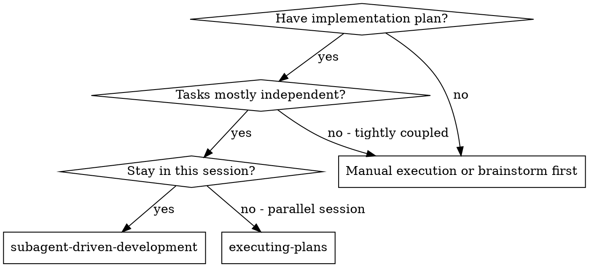
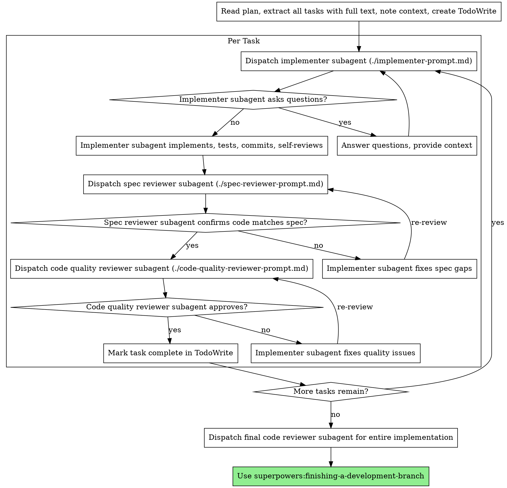

# Subagent-Driven Development

Execute plan by dispatching fresh subagent per task, with two-stage review after each: spec compliance review first, then code quality review.

**Core principle:** Fresh subagent per task + two-stage review (spec then quality) = high quality, fast iteration

## When to Use



**vs. Executing Plans (parallel session):**
- Same session (no context switch)
- Fresh subagent per task (no context pollution)
- Two-stage review after each task: spec compliance first, then code quality
- Faster iteration (no human-in-loop between tasks)

## The Process



## Model Selection

Use the least powerful model that can handle each role to conserve cost and increase speed.

**Mechanical implementation tasks** (isolated functions, clear specs, 1-2 files): use a fast, cheap model. Most implementation tasks are mechanical when the plan is well-specified.

**Integration and judgment tasks** (multi-file coordination, pattern matching, debugging): use a standard model.

**Architecture, design, and review tasks**: use the most capable available model.

**Task complexity signals:**
- Touches 1-2 files with a complete spec → cheap model
- Touches multiple files with integration concerns → standard model
- Requires design judgment or broad codebase understanding → most capable model

## Handling Implementer Status

Implementer subagents report one of four statuses. Handle each appropriately:

**DONE:** Proceed to spec compliance review.

**DONE_WITH_CONCERNS:** The implementer completed the work but flagged doubts. Read the concerns before proceeding. If the concerns are about correctness or scope, address them before review. If they're observations (e.g., "this file is getting large"), note them and proceed to review.

**NEEDS_CONTEXT:** The implementer needs information that wasn't provided. Provide the missing context and re-dispatch.

**BLOCKED:** The implementer cannot complete the task. Assess the blocker:
1. If it's a context problem, provide more context and re-dispatch with the same model
2. If the task requires more reasoning, re-dispatch with a more capable model
3. If the task is too large, break it into smaller pieces
4. If the plan itself is wrong, escalate to the human

**Never** ignore an escalation or force the same model to retry without changes. If the implementer said it's stuck, something needs to change.

## Prompt Templates

- `./implementer-prompt.md` - Dispatch implementer subagent
- `./spec-reviewer-prompt.md` - Dispatch spec compliance reviewer subagent
- `./code-quality-reviewer-prompt.md` - Dispatch code quality reviewer subagent

## Example Workflow

Every dispatch below is composed under [`docs/composing-subagent-briefs.md`](../../docs/composing-subagent-briefs.md) — seven sections, BSV Definition of Done, evidence-required verification, structured failure protocol.

```
You: I'm using Subagent-Driven Development to execute this plan.

[Read plan file once: docs/superpowers/plans/feature-plan.md]
[Extract all 5 tasks with full text and context]
[Create TodoWrite with all tasks]

═══════════════════════════════════════════════════════════════════
Task 1: Hook installation script
═══════════════════════════════════════════════════════════════════

[Compose implementer brief — seven sections]

  §1 Context Block:
    Why this mission exists: superpowers hooks need to ship with the install
      flow so new users get session-start + subagent-stop automation without
      manual setup. Without it, every new install requires copy-paste steps.
    What happened before: previous installer used a flat copy step; broke when
      hook permissions weren't preserved on macOS.
    What you need to know: install script lives at scripts/install.mjs; hook
      sources are in hooks/; target dir convention is ~/.config/superpowers/hooks/.
    Files to read: scripts/install.mjs, hooks/hooks.json, hooks/session-start.
    Mental model: you understand install.mjs as the orchestrator and the hooks
      as the cargo that needs to land in the user's config dir with exec bits set.

  §2 Mission Objective:
    Achieve: install.mjs places all four hook files under user-level
      ~/.config/superpowers/hooks/, preserves +x on shell hooks, and writes a
      hooks.json manifest the host platform will pick up.
    Hard constraints: no system-level install; do not modify hook source files.
    Priority signal: minimal diff over clean refactor.
    You own this mission end-to-end. The destination is fixed; the path is yours.

  §3 Research & Tool Guidance:
    Before you begin — if anything is unclear, ask now. Use MCP tools for code
    search if available; otherwise editor's built-in search.

  §4 Definition of Done (BSV):
    - All four hook files present at ~/.config/superpowers/hooks/ after install.
    - Shell hooks have +x (verifiable: stat output).
    - hooks.json manifest written and parseable.
    - All new tests pass; existing suite stays green.
    - TDD: failing test committed first, red-green sequence visible in log.

  §5 Verification: include test output + stat of installed files.
  §6 Failure Protocol: return DONE | DONE_WITH_CONCERNS | BLOCKED | NEEDS_CONTEXT.
  §7 Handback: Status, Summary, Changes (with SHAs), Evidence, Self-review.

[Dispatch implementer]

Implementer: "Before I begin — user or system level?" [NEEDS_CONTEXT]

You: "User level: ~/.config/superpowers/hooks/. Already in §2."

Implementer: [proceeds]
  Status: DONE
  Summary: install-hook command added; copies four files, preserves exec bits,
    writes manifest.
  Changes: scripts/install.mjs (+62), tests/install.test.mjs (new, +118).
    Commits: a7981ec (red), b3f2d51 (green), c9e0a8f (--force flag).
  Evidence: npm test → 5/5 pass; stat ~/.config/superpowers/hooks/* shows +x.
  Self-review: missed --force flag on first pass; caught and added.

[Compose spec-reviewer brief — same seven sections, Mission Objective is
 "Do Not Trust the Report", DoD = each requirement verified in actual code]
[Dispatch spec-reviewer]

Spec reviewer: ✅ Spec compliant — every requirement located in diff with
  file:line. No unrequested extras.

[Compose code-quality-reviewer brief — fills code-reviewer.md placeholders
 with BSV criteria from the task spec]
[Dispatch code-quality-reviewer with git range]

Code reviewer: Strengths — test coverage (tests/install.test.mjs:1-118),
  clear separation (install.mjs:42-89). Issues: none. Assessment: Approved.

[Mark Task 1 complete]

═══════════════════════════════════════════════════════════════════
Task 2: Recovery modes
═══════════════════════════════════════════════════════════════════

[Compose implementer brief; dispatch]

Implementer:
  Status: DONE
  Summary: added verify/repair modes to indexer with --verify and --repair flags.
  Changes: src/indexer.ts (+87), tests/indexer.test.ts (+8 cases).
  Evidence: 8/8 tests pass.
  Self-review: all good.

[Dispatch spec-reviewer]

Spec reviewer: ❌ Issues found:
  - Missing: progress reporting. Spec §4 requires "report every 100 items."
    indexer.ts:142 has no progress callback.
  - Extra: --json flag added at indexer.ts:38. Not in spec. Scope creep.

[Re-dispatch implementer with reviewer's findings as new Context Block input]

Implementer:
  Status: DONE
  Summary: removed --json flag, added PROGRESS_INTERVAL-based reporting.
  Evidence: 8/8 tests pass; new progress test covers every-100 case.

[Spec reviewer re-review] → ✅ Spec compliant now.

[Dispatch code-quality-reviewer]

Code reviewer: Strengths — solid coverage. Issues (Important): magic number
  100 at indexer.ts:145; extract as PROGRESS_INTERVAL constant.

[Re-dispatch implementer; fix is one-line]

Implementer: Extracted PROGRESS_INTERVAL = 100.

[Code-quality-reviewer re-review] → ✅ Approved.

[Mark Task 2 complete]

[... Tasks 3-5 follow the same loop ...]

═══════════════════════════════════════════════════════════════════
After all tasks
═══════════════════════════════════════════════════════════════════

[Compose final code-reviewer brief — Context Block covers the full diff range,
 Mission Objective is "production-readiness verdict", DoD = the original plan's
 spec criteria, all five tasks]
[Dispatch final code-reviewer]

Final reviewer: Assessment — Ready to merge. All five tasks trace cleanly to
  spec; tests green; no regressions; no scope creep beyond what was approved
  during the per-task review loops.

Done.
```

## Advantages

**vs. Manual execution:**
- Subagents follow TDD naturally
- Fresh context per task (no confusion)
- Parallel-safe (subagents don't interfere)
- Subagent can ask questions (before AND during work)

**vs. Executing Plans:**
- Same session (no handoff)
- Continuous progress (no waiting)
- Review checkpoints automatic

**Efficiency gains:**
- No file reading overhead (controller provides full text)
- Controller curates exactly what context is needed
- Subagent gets complete information upfront
- Questions surfaced before work begins (not after)

**Quality gates:**
- Self-review catches issues before handoff
- Two-stage review: spec compliance, then code quality
- Review loops ensure fixes actually work
- Spec compliance prevents over/under-building
- Code quality ensures implementation is well-built

**Cost:**
- More subagent invocations (implementer + 2 reviewers per task)
- Controller does more prep work (extracting all tasks upfront)
- Review loops add iterations
- But catches issues early (cheaper than debugging later)

## Red Flags

**Never:**
- Start implementation on main/master branch without explicit user consent
- Skip reviews (spec compliance OR code quality)
- Proceed with unfixed issues
- Dispatch multiple implementation subagents in parallel (conflicts)
- Make subagent read plan file (provide full text instead)
- Skip scene-setting context (subagent needs to understand where task fits)
- Ignore subagent questions (answer before letting them proceed)
- Accept "close enough" on spec compliance (spec reviewer found issues = not done)
- Skip review loops (reviewer found issues = implementer fixes = review again)
- Let implementer self-review replace actual review (both are needed)
- **Start code quality review before spec compliance is ✅** (wrong order)
- Move to next task while either review has open issues

**If subagent asks questions:**
- Answer clearly and completely
- Provide additional context if needed
- Don't rush them into implementation

**If reviewer finds issues:**
- Implementer (same subagent) fixes them
- Reviewer reviews again
- Repeat until approved
- Don't skip the re-review

**If subagent fails task:**
- Dispatch fix subagent with specific instructions
- Don't try to fix manually (context pollution)

## Integration

**Required workflow skills:**
- **superpowers:using-git-worktrees** - REQUIRED: Set up isolated workspace before starting
- **superpowers:writing-plans** - Creates the plan this skill executes
- **superpowers:requesting-code-review** - Code review template for reviewer subagents
- **superpowers:finishing-a-development-branch** - Complete development after all tasks

**Subagents should use:**
- **superpowers:test-driven-development** - Subagents follow TDD for each task

**Alternative workflow:**
- **superpowers:executing-plans** - Use for parallel session instead of same-session execution
